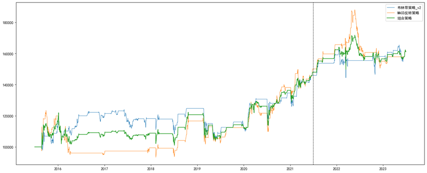

# Timing backtest
这是一个用于回测单标的择时策略的框架  
backtest.py是回测框架；trading_signal.py是生成交易信号的择时策略；filter.py是简单的傅里叶滤波   

## 回测

Timing_backtest_minute中实现了对分钟频率的择时策略的回测         
Timing_backtest_day中实现了对日频率的择时策略的回测，在Timing_backtest_day中支持对策略性能指标的计算
- 平均收益率
- 标准差
- 夏普比率
- 最大回撤
- 开仓次数
- 胜率
- 盈亏比
    
回测的策略是支持多仓，平仓，空仓三个动作，分别表示为1、0、-1；当前为空仓时，可以开多仓和空仓，当前为多仓或空仓时可以反向开仓或者平仓

 

## 策略
我实现了两个策略来验证回测框架的有效性
### 布林带策略
本策略所用的布林带指标定义如下：    
H_line = CLOSE + 2 *  std(CLOSE, 20)    
M_line = MA(CLOSE, 20)  
L_line = CLOSE - 2 * std(CLOSE, 20)

信号产生规则如下，得到布林带策略：    
- 开多仓判断：当收盘价下穿布林带下轨时，即CLOSE[i-1] < L_line[i-1]，且当前未开多仓，则signal[i] = 1；    
- 开空仓判断：当收盘价上穿布林带上轨时，即CLOSE[i-1] > H_line[i-1]，且当前未开空仓，则signal[i] = -1；   
- 平仓判断：若当前开多仓，当CLOSE[i-1] > M_line[i-1]时平仓，signal[i] = 0；若当前开空仓，当CLOSE[i-1] < M_line[i-1]时平仓，signal[i] = 0.
### MACD策略
本策略采用的MACD指标如下：  
DIF = EMA(CLOSE, 12) - EMA(CLOSE, 26)   
DEA = EMA(DIF, 9)   
MACD = DIF - DEA

信号产生规则如下，得到MACD反转策略：    
- 开多仓判断：当MACD[i-1] < -20，且当前未开多仓，则signal[i] = 1；  
- 开空仓判断：当MACD[i-1] > 20，且当前未开空仓，则signal[i] = -1；  
- 平仓判断：若当前开多仓，当0 < MACD[i-1]≤20时平仓，signal[i] = 0；若当前开空仓，当-20≤ MACD[i-1] < 0时平仓，signal[i] = 0.

## 结果呈现
我构造了组合策略：将初始资金均分成两份，一份投资于布林带策略_v1，一份投资于MACD反转策略，得到组合策略。     
我在2015年7月1日到2023年6月30日的日频沪深300期货主力数据上回测了布林带策略和MACD策略，以及组合策略，结果如下。
